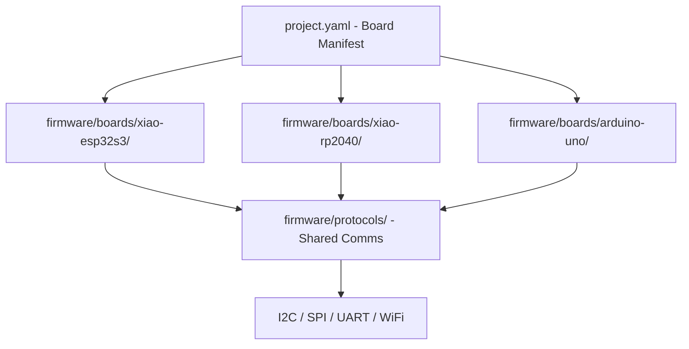

# Microcontroller Project Template — Architecture

This document defines the directory structure, conventions, and organization for microcontroller projects built from this template. It supports multi-board projects, multiple languages, 3D printing assets, and AI agent skills.

---

## Table of Contents

1. [Complete Directory Tree](#complete-directory-tree)
2. [Top-Level Directory Purposes](#top-level-directory-purposes)
3. [Multi-Board Project Organization](#multi-board-project-organization)
4. [Firmware Source Code Organization](#firmware-source-code-organization)
5. [3D Printing File Organization](#3d-printing-file-organization)
6. [Agent Skills — Naming and Organization](#agent-skills--naming-and-organization)
7. [Configuration Files](#configuration-files)
8. [Template Files Included](#template-files-included)
9. [Getting Started After Cloning](#getting-started-after-cloning)

---

## Complete Directory Tree

```
microcontroller-base/
│
├── README.md                          # Project overview, quick-start
├── LICENSE
├── .gitignore
│
├── docs/                              # Project documentation
│   ├── ARCHITECTURE.md                # This file
│   ├── WIRING.md                      # Wiring diagrams and pin connections
│   ├── BOM.md                         # Bill of materials
│   └── images/                        # Documentation images
│       └── .gitkeep
│
├── firmware/                          # All firmware source code
│   ├── README.md                      # Firmware overview, build instructions
│   │
│   ├── boards/                        # Per-board firmware, organized by language
│   │   ├── xiao-esp32s3/
│   │   │   ├── tinygo/
│   │   │   │   ├── main.go
│   │   │   │   ├── go.mod
│   │   │   │   └── README.md
│   │   │   ├── arduino/
│   │   │   │   ├── xiao-esp32s3.ino
│   │   │   │   └── README.md
│   │   │   └── config.yaml            # Board-specific pin map and config
│   │   │
│   │   ├── xiao-esp32c3/
│   │   │   ├── tinygo/
│   │   │   ├── arduino/
│   │   │   └── config.yaml
│   │   │
│   │   ├── xiao-rp2040/
│   │   │   ├── tinygo/
│   │   │   ├── arduino/
│   │   │   └── config.yaml
│   │   │
│   │   ├── arduino-uno/
│   │   │   ├── tinygo/
│   │   │   ├── arduino/
│   │   │   └── config.yaml
│   │   │
│   │   └── ...                        # Additional boards as needed
│   │
│   ├── shared/                        # Shared libraries and utilities
│   │   ├── tinygo/
│   │   │   └── .gitkeep
│   │   └── arduino/
│   │       └── .gitkeep
│   │
│   └── protocols/                     # Communication protocol implementations
│       ├── i2c/
│       │   └── .gitkeep
│       ├── spi/
│       │   └── .gitkeep
│       ├── uart/
│       │   └── .gitkeep
│       └── wifi/
│           └── .gitkeep
│
├── circuits/                          # Custom PCB design (atopile)
│   ├── README.md                      # Circuit design guide
│   ├── ato.yaml                       # Atopile project manifest
│   ├── elec/
│   │   └── src/
│   │       └── main.ato              # Main circuit entry point
│   ├── layouts/                       # KiCad PCB layout files
│   │   └── .gitkeep
│   └── build/                         # Build outputs (Gerber, BOM, etc.)
│       └── .gitkeep
│
├── models/                            # 3D printing files
│   ├── README.md                      # Printing guidelines, material notes
│   │
│   ├── enclosures/                    # Cases and housings for boards
│   │   └── .gitkeep
│   │
│   ├── mounts/                        # Mounting brackets, standoffs, clips
│   │   └── .gitkeep
│   │
│   ├── robotics/                      # Structural and mechanical parts
│   │   └── .gitkeep
│   │
│   ├── jigs/                          # Assembly jigs and alignment tools
│   │   └── .gitkeep
│   │
│   └── _source/                       # Editable source files - F3D, SCAD, STEP
│       └── .gitkeep
│
├── config/                            # Project-level configuration
│   ├── project.yaml                   # Project metadata and board manifest
│   └── pins/                          # Shared pin mapping references
│       └── .gitkeep
│
├── scripts/                           # Build, flash, and utility scripts
│   ├── flash.sh                       # Flash firmware to a board
│   ├── build.sh                       # Build firmware for a target
│   └── README.md
│
├── tests/                             # Test files
│   └── .gitkeep
│
└── .roo/                              # Roo Code AI agent configuration
    ├── mcp.json                       # MCP server config
    └── skills/                        # Agent skills for board reference
        │
        ├── XIAO-SAMD21-TinyGo/
        │   └── SKILL.md
        ├── XIAO-SAMD21-Arduino/
        │   └── SKILL.md
        │
        ├── XIAO-nRF52840-TinyGo/
        │   └── SKILL.md
        ├── XIAO-nRF52840-Arduino/
        │   └── SKILL.md
        │
        ├── XIAO-nRF52840Sense-TinyGo/
        │   └── SKILL.md
        ├── XIAO-nRF52840Sense-Arduino/
        │   └── SKILL.md
        │
        ├── XIAO-RP2040-TinyGo/
        │   └── SKILL.md
        ├── XIAO-RP2040-Arduino/
        │   └── SKILL.md
        │
        ├── XIAO-ESP32C3-TinyGo/
        │   └── SKILL.md
        ├── XIAO-ESP32C3-Arduino/
        │   └── SKILL.md
        │
        ├── XIAO-ESP32S3-TinyGo/
        │   └── SKILL.md
        ├── XIAO-ESP32S3-Arduino/
        │   └── SKILL.md
        │
        ├── XIAO-ESP32S3Sense-TinyGo/
        │   └── SKILL.md
        ├── XIAO-ESP32S3Sense-Arduino/
        │   └── SKILL.md
        │
        ├── XIAO-ESP32C6-TinyGo/
        │   └── SKILL.md
        ├── XIAO-ESP32C6-Arduino/
        │   └── SKILL.md
        │
        ├── XIAO-RP2350-TinyGo/
        │   └── SKILL.md
        ├── XIAO-RP2350-Arduino/
        │   └── SKILL.md
        │
        ├── XIAO-RA4M1-TinyGo/
        │   └── SKILL.md
        ├── XIAO-RA4M1-Arduino/
        │   └── SKILL.md
        │
        ├── XIAO-MG24-TinyGo/
        │   └── SKILL.md
        ├── XIAO-MG24-Arduino/
        │   └── SKILL.md
        │
        ├── XIAO-MG24Sense-TinyGo/
        │   └── SKILL.md
        ├── XIAO-MG24Sense-Arduino/
        │   └── SKILL.md
        │
        ├── XIAO-nRF54L15-TinyGo/
        │   └── SKILL.md
        ├── XIAO-nRF54L15-Arduino/
        │   └── SKILL.md
        │
        ├── XIAO-nRF54L15Sense-TinyGo/
        │   └── SKILL.md
        ├── XIAO-nRF54L15Sense-Arduino/
        │   └── SKILL.md
        │
        ├── XIAO-ESP32C5-TinyGo/
        │   └── SKILL.md
        ├── XIAO-ESP32C5-Arduino/
        │   └── SKILL.md
        │
        ├── Arduino-Uno-TinyGo/
        │   └── SKILL.md
        ├── Arduino-Uno-Arduino/
        │   └── SKILL.md
        │
        ├── Arduino-Nano-TinyGo/
        │   └── SKILL.md
        ├── Arduino-Nano-Arduino/
        │   └── SKILL.md
        │
        ├── Arduino-Mega2560-TinyGo/
        │   └── SKILL.md
        └── Arduino-Mega2560-Arduino/
            └── SKILL.md
```

---

## Top-Level Directory Purposes

### `docs/`
Project-level documentation including this architecture file, wiring diagrams, bill of materials, and supporting images. This is the human-readable knowledge base for the project.

### `firmware/`
All firmware source code, organized by board and then by language. Contains per-board directories under `firmware/boards/`, shared libraries under `firmware/shared/`, and communication protocol implementations under `firmware/protocols/`.

### `circuits/`
Custom PCB design files using [atopile](https://atopile.io/), a code-first hardware design tool. Source `.ato` files define circuits as code, which compile to KiCad schematics and PCB layouts. Build outputs include Gerber files, BOMs, and pick-and-place files for manufacturing.

### `models/`
3D printing and CAD files for physical components — enclosures, mounts, robotics parts, and assembly jigs. Printable STL files live in the category folders; editable source files live in `models/_source/`.

### `config/`
Project-level configuration including the board manifest and shared pin mappings. Board-specific configs live alongside their firmware in `firmware/boards/<board>/config.yaml`.

### `scripts/`
Build, flash, and utility scripts. These abstract away toolchain differences between boards and languages.

### `tests/`
Test files for firmware validation, integration tests, and hardware-in-the-loop testing.

### `.roo/skills/`
AI agent skill definitions following the Roo Code skill system. Each skill provides board-specific and language-specific reference information so AI agents can generate correct firmware code.

---

## Multi-Board Project Organization

Multi-board projects use multiple boards working together — for example, a Raspberry Pi as a central controller with several XIAO boards as peripheral sensor/actuator nodes.

### Architecture Diagram



### Board Manifest

The file `config/project.yaml` declares which boards are used and their roles:

```yaml
project:
  name: my-robot
  description: A robot with distributed sensor nodes

boards:
  - id: controller
    board: xiao-esp32s3
    language: tinygo
    role: Central controller and WiFi gateway
    
  - id: left-arm
    board: xiao-rp2040
    language: tinygo
    role: Left arm servo controller
    connection:
      protocol: i2c
      address: 0x10
      
  - id: right-arm
    board: xiao-rp2040
    language: tinygo
    role: Right arm servo controller
    connection:
      protocol: i2c
      address: 0x11

  - id: sensor-hub
    board: arduino-uno
    language: arduino
    role: Environmental sensor aggregator
    connection:
      protocol: uart
      baud: 115200
```

### Firmware Directory Naming

Board directories under `firmware/boards/` use lowercase-kebab-case matching the board identifier:

| Board | Directory Name |
|-------|---------------|
| XIAO SAMD21 | `xiao-samd21` |
| XIAO nRF52840 | `xiao-nrf52840` |
| XIAO nRF52840 Sense | `xiao-nrf52840-sense` |
| XIAO RP2040 | `xiao-rp2040` |
| XIAO ESP32-C3 | `xiao-esp32c3` |
| XIAO ESP32-S3 | `xiao-esp32s3` |
| XIAO ESP32-S3 Sense | `xiao-esp32s3-sense` |
| XIAO ESP32-C6 | `xiao-esp32c6` |
| XIAO RP2350 | `xiao-rp2350` |
| XIAO RA4M1 | `xiao-ra4m1` |
| XIAO MG24 | `xiao-mg24` |
| XIAO MG24 Sense | `xiao-mg24-sense` |
| XIAO nRF54L15 | `xiao-nrf54l15` |
| XIAO nRF54L15 Sense | `xiao-nrf54l15-sense` |
| XIAO ESP32-C5 | `xiao-esp32c5` |
| Arduino Uno | `arduino-uno` |
| Arduino Nano | `arduino-nano` |
| Arduino Mega 2560 | `arduino-mega2560` |

### Inter-Board Communication

Shared protocol implementations live in `firmware/protocols/`. Each board's firmware imports from these shared modules to ensure consistent message formats across the system.

When two boards communicate, document the connection in:
1. `config/project.yaml` — the board manifest declares the protocol and addressing
2. `docs/WIRING.md` — physical wiring between boards
3. `firmware/protocols/<protocol>/` — shared message definitions and helpers

---

## Firmware Source Code Organization

### Per-Board Structure

Each board directory contains language subdirectories and a board config:

```
firmware/boards/<board-name>/
├── tinygo/
│   ├── main.go
│   ├── go.mod
│   └── README.md
├── arduino/
│   ├── <board-name>.ino
│   └── README.md
└── config.yaml
```

### Board Config File

Each `config.yaml` defines the board's pin mappings and capabilities:

```yaml
board:
  name: XIAO ESP32-S3
  manufacturer: Seeed Studio
  mcu: ESP32-S3
  
pins:
  digital:
    D0: GPIO1
    D1: GPIO2
    D2: GPIO3
    # ...
  analog:
    A0: GPIO1
    A1: GPIO2
  i2c:
    sda: GPIO5
    scl: GPIO6
  spi:
    mosi: GPIO9
    miso: GPIO8
    sck: GPIO7
  uart:
    tx: GPIO43
    rx: GPIO44

features:
  wifi: true
  bluetooth: true
  camera: false
  microphone: false
  flash_mb: 8
  ram_kb: 512
```

### Shared Libraries

Code shared across boards lives in `firmware/shared/`, split by language:

- `firmware/shared/tinygo/` — Go packages importable by any board's TinyGo firmware
- `firmware/shared/arduino/` — Arduino libraries usable by any board's Arduino firmware

---

## 3D Printing File Organization

### Directory Structure

```
models/
├── README.md              # Print settings, material recommendations
├── enclosures/            # Board cases and project housings
│   ├── xiao-case-v1.stl
│   └── controller-box.stl
├── mounts/                # Brackets, standoffs, DIN rail clips
│   └── xiao-din-mount.stl
├── robotics/              # Arms, joints, chassis, gears
│   └── arm-segment-a.stl
├── jigs/                  # Assembly and soldering jigs
│   └── pin-header-jig.stl
└── _source/               # Editable CAD source files
    ├── xiao-case-v1.f3d
    ├── xiao-case-v1.step
    └── controller-box.scad
```

### File Format Conventions

| Format | Extension | Purpose |
|--------|-----------|---------|
| STL | `.stl` | Print-ready mesh — goes in category folders |
| STEP | `.step` | Interchange CAD format — goes in `_source/` |
| Fusion 360 | `.f3d` | Parametric source — goes in `_source/` |
| OpenSCAD | `.scad` | Programmatic CAD source — goes in `_source/` |
| 3MF | `.3mf` | Print-ready with metadata — goes in category folders |

### Naming Convention

Model files use lowercase-kebab-case with an optional version suffix:

```
<descriptive-name>[-v<version>].<ext>
```

Examples: `xiao-case-v2.stl`, `servo-mount.step`, `chassis-base.scad`

### README Contents

The `models/README.md` should document:
- Recommended slicer settings per part
- Material recommendations — PLA, PETG, TPU, etc.
- Tolerance notes for board fitment
- Assembly order if parts interlock

---

## Agent Skills — Naming and Organization

### Skill Naming Convention

Skills follow the pattern:

```
<Family>-<Model>-<Language>
```

| Segment | Convention | Examples |
|---------|-----------|----------|
| Family | Brand or product line | `XIAO`, `Arduino` |
| Model | Board model, PascalCase, no hyphens | `ESP32S3`, `nRF52840Sense`, `Uno`, `Mega2560` |
| Language | Target language/framework | `TinyGo`, `Arduino` |

### Complete Skill List

**XIAO boards — 15 models × 2 languages = 30 skills:**

| Board | TinyGo Skill | Arduino Skill |
|-------|-------------|---------------|
| XIAO SAMD21 | `XIAO-SAMD21-TinyGo` | `XIAO-SAMD21-Arduino` |
| XIAO nRF52840 | `XIAO-nRF52840-TinyGo` | `XIAO-nRF52840-Arduino` |
| XIAO nRF52840 Sense | `XIAO-nRF52840Sense-TinyGo` | `XIAO-nRF52840Sense-Arduino` |
| XIAO RP2040 | `XIAO-RP2040-TinyGo` | `XIAO-RP2040-Arduino` |
| XIAO ESP32-C3 | `XIAO-ESP32C3-TinyGo` | `XIAO-ESP32C3-Arduino` |
| XIAO ESP32-S3 | `XIAO-ESP32S3-TinyGo` | `XIAO-ESP32S3-Arduino` |
| XIAO ESP32-S3 Sense | `XIAO-ESP32S3Sense-TinyGo` | `XIAO-ESP32S3Sense-Arduino` |
| XIAO ESP32-C6 | `XIAO-ESP32C6-TinyGo` | `XIAO-ESP32C6-Arduino` |
| XIAO RP2350 | `XIAO-RP2350-TinyGo` | `XIAO-RP2350-Arduino` |
| XIAO RA4M1 | `XIAO-RA4M1-TinyGo` | `XIAO-RA4M1-Arduino` |
| XIAO MG24 | `XIAO-MG24-TinyGo` | `XIAO-MG24-Arduino` |
| XIAO MG24 Sense | `XIAO-MG24Sense-TinyGo` | `XIAO-MG24Sense-Arduino` |
| XIAO nRF54L15 | `XIAO-nRF54L15-TinyGo` | `XIAO-nRF54L15-Arduino` |
| XIAO nRF54L15 Sense | `XIAO-nRF54L15Sense-TinyGo` | `XIAO-nRF54L15Sense-Arduino` |
| XIAO ESP32-C5 | `XIAO-ESP32C5-TinyGo` | `XIAO-ESP32C5-Arduino` |

**Arduino boards — 3 models × 2 languages = 6 skills:**

| Board | TinyGo Skill | Arduino Skill |
|-------|-------------|---------------|
| Arduino Uno | `Arduino-Uno-TinyGo` | `Arduino-Uno-Arduino` |
| Arduino Nano | `Arduino-Nano-TinyGo` | `Arduino-Nano-Arduino` |
| Arduino Mega 2560 | `Arduino-Mega2560-TinyGo` | `Arduino-Mega2560-Arduino` |

**Total: 36 skills**

### Skill File Structure

Each skill directory contains a single `SKILL.md` file:

```
.roo/skills/<Skill-Name>/
└── SKILL.md
```

### SKILL.md Template

Each `SKILL.md` should contain:

```markdown
# <Board Name> — <Language> Skill

## Description
Reference information for writing <Language> firmware targeting the <Board Name>.

## Board Specifications
- **MCU:** <chip>
- **Flash:** <size>
- **RAM:** <size>
- **GPIO Count:** <count>
- **Operating Voltage:** <voltage>

## Pin Mapping
| Pin Label | GPIO | Analog | PWM | Notes |
|-----------|------|--------|-----|-------|
| D0        | GPIOx | —     | Yes | —     |
| ...       | ...   | ...   | ... | ...   |

## Supported Peripherals
- I2C: <pins>
- SPI: <pins>
- UART: <pins>
- ADC: <pins>
- WiFi: Yes/No
- Bluetooth: Yes/No

## <Language>-Specific Notes
- Target/board identifier for toolchain
- Required packages or board manager URLs
- Known limitations or workarounds
- Minimum blink example

## Useful Links
- Datasheet: <url>
- Schematic: <url>
- Wiki/Docs: <url>
```

---

## Configuration Files

### `config/project.yaml`

The project manifest — declares boards, roles, and connections:

```yaml
project:
  name: <project-name>
  description: <one-line description>
  version: 0.1.0

boards: []
  # See Multi-Board Project Organization section for format
```

### `firmware/boards/<board>/config.yaml`

Board-specific pin mappings and feature flags. See the Board Config File section above.

### `config/pins/`

Optional shared pin mapping references for cross-board consistency — useful when multiple boards of the same type are used with different pin assignments per role.

---

## Template Files Included

The following files should exist in the template repository so that cloned projects have a working structure immediately:

### Root Level
| File | Purpose |
|------|---------|
| `README.md` | Project overview and quick-start guide |
| `LICENSE` | License file |
| `.gitignore` | Ignores build artifacts, IDE files, compiled binaries |

### Documentation
| File | Purpose |
|------|---------|
| `docs/ARCHITECTURE.md` | This file |
| `docs/WIRING.md` | Wiring diagram template |
| `docs/BOM.md` | Bill of materials template |
| `docs/images/.gitkeep` | Placeholder for documentation images |

### Circuits
| File | Purpose |
|------|---------|
| `circuits/README.md` | Circuit design guide and atopile workflow |
| `circuits/ato.yaml` | Atopile project manifest template |
| `circuits/elec/src/main.ato` | Main circuit entry point template |
| `circuits/layouts/.gitkeep` | Placeholder for KiCad layout files |
| `circuits/build/.gitkeep` | Placeholder for build outputs |

### Firmware
| File | Purpose |
|------|---------|
| `firmware/README.md` | Build and flash instructions |
| `firmware/shared/tinygo/.gitkeep` | Placeholder for shared TinyGo code |
| `firmware/shared/arduino/.gitkeep` | Placeholder for shared Arduino code |
| `firmware/protocols/i2c/.gitkeep` | Placeholder for I2C protocol code |
| `firmware/protocols/spi/.gitkeep` | Placeholder for SPI protocol code |
| `firmware/protocols/uart/.gitkeep` | Placeholder for UART protocol code |
| `firmware/protocols/wifi/.gitkeep` | Placeholder for WiFi protocol code |

### 3D Models
| File | Purpose |
|------|---------|
| `models/README.md` | Printing guidelines and material notes |
| `models/enclosures/.gitkeep` | Placeholder for enclosure models |
| `models/mounts/.gitkeep` | Placeholder for mount models |
| `models/robotics/.gitkeep` | Placeholder for robotics parts |
| `models/jigs/.gitkeep` | Placeholder for jig models |
| `models/_source/.gitkeep` | Placeholder for editable CAD source files |

### Configuration
| File | Purpose |
|------|---------|
| `config/project.yaml` | Project board manifest template |
| `config/pins/.gitkeep` | Placeholder for shared pin mappings |

### Scripts
| File | Purpose |
|------|---------|
| `scripts/flash.sh` | Flash script template |
| `scripts/build.sh` | Build script template |
| `scripts/README.md` | Script usage documentation |

### Tests
| File | Purpose |
|------|---------|
| `tests/.gitkeep` | Placeholder for test files |

### Agent Skills
| File | Purpose |
|------|---------|
| `.roo/skills/<Skill-Name>/SKILL.md` | 36 skill files — one per board+language combination |

---

## Getting Started After Cloning

1. **Edit `config/project.yaml`** — declare which boards your project uses and their roles
2. **Create board firmware directories** — add directories under `firmware/boards/` for each board in your manifest
3. **Choose your language** — create `tinygo/` or `arduino/` subdirectories as needed
4. **Design custom PCBs** (optional) — edit `.ato` files in `circuits/elec/src/` and build with `ato build`
5. **Wire it up** — document physical connections in `docs/WIRING.md`
6. **Add 3D models** — drop STL files in the appropriate `models/` subdirectory, source files in `models/_source/`
7. **Use agent skills** — the `.roo/skills/` directory gives AI agents the context they need to help write firmware for your specific boards

### Recommended .gitignore Entries

```gitignore
# Build artifacts
firmware/boards/*/tinygo/build/
firmware/boards/*/arduino/build/

# IDE files
.vscode/
.idea/
*.swp
*.swo

# OS files
.DS_Store
Thumbs.db

# Compiled binaries
*.elf
*.hex
*.bin
*.uf2

# Atopile
circuits/.ato/
circuits/build/
```
